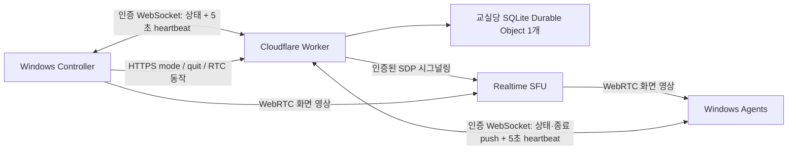

# ClassRelay

[English](README.md) | **한국어**

회사 소유 Windows 교육용 노트북을 위한 화면 송출·수업 입력 잠금. Cloudflare로 동작한다.

ClassRelay는 강사 1명과 학생 장비 약 30대를 위한 PoC다. 서로 다른 Wi-Fi에 있는 장비도 포함한다. 강사가 화면을 선택하면 학생 노트북에 전체화면으로 표시하고, 수업 중에는 학생 입력을 차단할 수 있다. 실습 모드는 학생 바탕화면을 되돌려 준다.

> **상태: PoC.** 백엔드는 실배포 대상 실측을 마쳤고, 강사 1대 → 학생 1대 화면 송출과 학생 앱 종료는 실장비에서 동작했으며, 실배포 Worker에 학생 30연결을 유지하는 것까지 확인했다. Windows 입력 잠금, 송출 중 화면 교체, 실제 대역폭, 실제 30대, 5시간 soak, 로그인 자동 시작은 **검증하지 않았다.** [현황](#현황)을 본다. 데스크톱 앱 화면은 한국어이며 저장소 문서는 영문을 기본으로 한글 버전을 함께 둔다.

## 기능

- Electron으로 만든 Windows **Controller**(강사)와 **Agent**(학생) 앱.
- 자유 실습부터 완전한 입력 잠금까지 4가지 수업 모드.
- Cloudflare Realtime SFU 영상 전달, 제한된 네트워크용 TURN 선택 지원.
- Worker와 Durable Object를 통한 인증된 교실 상태·시그널링.
- 장시간 수업이 대역폭 예산 안에 머물도록 장비별 송출 품질 상한.
- 자동 재연결과 Windows 로그인 후 자동 시작 설정.
- 강사 앱의 모든 동작에 상한 시간 — 멈춘 화면 캡처가 버튼을 죽여 두지 못한다 — 그리고 장비당 앱 인스턴스 하나.
- 15초 제어 lease, 독립 네이티브 watchdog, 프리즈 영상 감지, `Ctrl+Shift+F12` 비상 해제.
- 장비별 자격증명. 영구 SFU/TURN 비밀은 백엔드에만 둔다.

ClassRelay는 학생 화면·파일·키 입력을 수집하지 않고 원격 마우스·키보드 조작을 제공하지 않는다. 입력 차단은 수업 집중을 위한 것이며 Windows 보안 화면이나 `Ctrl+Alt+Delete`를 막지 않는다.

## 수업 모드

강사는 4가지 모드 중 하나를 고른다. wire 값은 백엔드가 저장하는 값이고, 한국어 라벨은 두 앱이 표시하는 값이다.

| wire | 한국어 라벨 | 학생 화면 | 학생 입력 |
|---|---|---|---|
| `practice` | 실습 | Agent 창 숨김 | 자유 |
| `broadcast` | 화면 보여주기 | 강사 화면, 전체화면 | 자유 |
| `lecture` | 이론 모드 | 강사 화면, 가림 없는 전체화면 | 차단 |
| `lock` | 강사 주목 | 의도적으로 가림 | 차단 |

실습이 아닌 모든 모드는 Agent 창을 kiosk 전체화면으로 만들어 Windows 작업 표시줄과 창 크롬을 덮는다. **kiosk는 입력 잠금이 아니다.** 창 크롬을 가릴 뿐 키 입력을 막지 않는다. `broadcast`에서는 학생 입력을 의도적으로 자유롭게 둔다.

입력을 차단하는 모드는 정확히 둘이며, 판정은 한 함수가 한다. `locksInput(mode)`는 `lecture`와 `lock`에서만 참이다. 이 함수는 `backend/src/index.ts`와 `apps/src/safety.cjs` 양쪽에 있고 모든 잠금 분기가 이 함수를 거치므로, `lecture`는 `lock`이 가진 모든 해제 경로를 그대로 물려받는다.

`broadcast`·`lecture`·`lock`은 모두 강사가 publish한 트랙이 있어야 하고 강사 lease를 유지한다. `practice`만 stream이 null이며, 모든 해제가 되돌아가는 fail-safe 기본값이다.

실제 키보드·마우스 억제는 해당 장비 설정의 `nativeInputLock`이 `true`여야 한다. 기본값은 `false`이고, 꺼진 상태에서는 두 잠금 모드가 오버레이만 띄울 뿐 아무것도 억제하지 않는다.

## Fail-safe 보장

- **lease는 15초다.** 실습이 아닌 모드는 lease 만료, 강사 연결 종료, 새 강사 연결에서 `practice`로 해제된다. 해제는 revision을 올리고 stream을 지운다.
- **해제된 revision은 해제 상태로 남는다.** 재연결, 오래된 상태 프레임, 늦게 도착한 서버 응답으로 다시 잠기지 않는다. 더 높은 revision의 새 강사 명령만 다시 잠글 수 있다.
- **Agent는 스스로 해제한다.** 로컬 lease 안에 새 유효 상태를 받지 못하거나, 렌더러가 응답을 멈추거나, 프로세스가 종료되면 로컬 watchdog이 교실 화면과 입력 guard를 내린다.
- **멈춘 화면은 정상이 아니라 장애로 센다.** 디코딩된 프레임의 최신성이 학생의 media-ready 신호를 결정한다. 일정 시간 이상 정체되면 신호가 꺼지고, 그러면 네이티브 잠금 갱신이 멈추며 해당 revision에 해제가 latch된다.
- **`Ctrl+Shift+F12`는 즉시 해제하고** 그 revision을 해제 상태로 latch한다. 모든 모드에서 동작한다.
- **어떤 학생 화면도 이 단축키를 표시하지 않는다.** 어느 장비에서도, 어느 모드에서도 표시하지 않는다. 따라서 `nativeInputLock`을 켜기 전에 현장 담당자에게 단축키를 안내하는 것은 선택이 아니라 필수 전제다.
- **네이티브 helper는 자체 watchdog을 가진다.** `InputGuard.exe`는 자기 lease 만료, EOF, 비상 단축키에서 Electron 앱과 무관하게 해제한다.

## 학생 화면에 보이는 것

정상적인 비실습 모드에서는 강사 영상만 보인다. 상태 표시줄도, 실측값도, 모드 안내도 없다. 오버레이는 네 가지 장애에서만 말한다. 제어 연결이 끊겼거나 재연결 중일 때, 구독을 재시도할 때, 구독이 실패했을 때, 그리고 프리즈 안전 해제·비상 단축키·네이티브 guard 장애·종료 요청으로 잠금이 풀렸을 때다.

실측 송출·수신 통계는 **강사** 화면에만 표시한다.

## 학생 앱 종료

`POST /api/agents/quit`는 강사 전용이며 현재 연결된 모든 Agent에 종료를 요청한다. 이 명령은 어디에도 저장하지 않는 일회성이다. 명령 이후에 접속한 장비는 이 명령을 받지 못하고 종료되지도 않는다. mode·revision·lease·stream 어느 것도 건드리지 않는다.

**반대 명령은 없다.** 강사는 학생 앱을 원격으로 다시 켤 수 없다. 해당 장비 앞의 사람이 다시 실행하거나, 자동 시작이 설정된 곳에서는 다음 Windows 로그인 때 실행된다.

## 구조



제어 상태는 인증된 WebSocket `GET /api/connect`으로 유지한다. Worker는 연결 직후 현재 상태를 보내고 명령이 바뀔 때마다 push한다. 각 클라이언트는 5초마다 `heartbeat` 메시지를 보낸다. 강사는 mode·quit·RTC 동작을 인증된 HTTPS endpoint로 보낸다. REST 상태·heartbeat 경로는 호환성·진단용으로만 남으며 앱은 폴링하지 않는다. Durable Object의 WebSocket hibernation은 인증된 연결 attachment를 보존하지만 유효한 강사 lease를 초기화하지 않는다.

수업 중 공유 화면 교체는 `RTCRtpSender.replaceTrack()`으로 송출 트랙을 제자리에서 바꾼다. 재협상도, 새 SFU 세션도, mode 명령도 없으므로 revision이 바뀌지 않는다. 즉 화면을 바꾸는 행위로는 잠글 수도 풀 수도 없다.

[아키텍처와 보안 경계](docs/architecture.ko.md)와 [통신 규격](docs/protocol.ko.md)을 본다.

## 저장소 구성

```text
apps/                 Windows Controller / Agent와 안전장치 테스트
backend/              Worker, Durable Object, SFU/TURN 중계
native-input/         선택 사항인 Windows 입력 guard와 watchdog
scripts/provision.mjs 장비별 자격증명·설정 생성기
scripts/ws-smoke.mjs  로컬 30연결 WebSocket fail-safe 스모크 테스트
docs/                 아키텍처, 통신 규격, 검증 기록, 현장 검증표
docs/assets/          저장소 배너
```

## 준비

- Windows 10/11, Node.js 24 LTS와 npm.
- Cloudflare 계정과 Realtime SFU App ID/Token.
- 제한된 네트워크용 TURN Key ID/API Token(선택).
- Cloudflare DNS로 관리 중인 기존 도메인의 서브도메인.
- 네이티브 helper 빌드용 .NET Framework 4.x C# 컴파일러.

## 로컬 개발

PowerShell에서 다음을 실행한다.

```powershell
git clone https://github.com/kindsusu/classrelay.git
Set-Location classrelay
npm.cmd ci --prefix backend
npm.cmd ci --prefix apps
Copy-Item -LiteralPath backend/.dev.vars.example -Destination backend/.dev.vars
node scripts/provision.mjs http://127.0.0.1:8787 30
```

`backend/.dev.vars`의 `CONTROLLER_TOKEN`과 `AGENT_TOKENS_JSON`에 생성된 backend secrets 값을 넣고 SFU 자격증명을 채운다. 토큰 맵은 deviceId를 토큰에 대응시키는 JSON 객체여야 한다. 로컬 Worker는 SFU를 에뮬레이션하지 않으므로 실제 화면 송출에는 진짜 Cloudflare 자격증명이 필요하다.

백엔드를 시작한다.

```powershell
npm.cmd run dev --prefix backend
```

다른 터미널에서 강사용 앱을 시작한다.

```powershell
$env:CLASSROOM_CONFIG = (Resolve-Path -LiteralPath provisioned/controller.local.json).Path
npm.cmd start --prefix apps
```

학생 앱은 해당 장비의 설정으로 시작한다.

```powershell
$env:CLASSROOM_CONFIG = (Resolve-Path -LiteralPath provisioned/student-01.local.json).Path
npm.cmd start --prefix apps
```

`127.0.0.1`은 같은 개발 PC에서만 동작한다. 다른 네트워크의 장비는 배포된 HTTPS origin을 써야 한다. 한 PC에서 두 역할을 시험하면 학생 전체화면이 강사 창을 가릴 수 있으니 `Ctrl+Shift+F12` 비상 단축키를 먼저 확인한다.

## 장비 프로비저닝

`node scripts/provision.mjs <백엔드 origin> <장비 수>`는 강사 설정 1개, 학생 장비별 설정, `provisioned/`의 `backend-secrets.local.json`을 만든다. 비밀 값을 화면에 출력하지 않으며 기존 파일이 있으면 덮어쓰기를 거부한다. 이 폴더는 Git에서 제외한다. Windows 파일 권한으로 접근을 제한하고 각 장비에는 그 장비의 설정만 배포한다.

학생 장비마다 자기 `deviceId`에 묶인 서로 다른 임의 토큰을 받는다. 토큰 하나를 30대에 복제하지 않는다. 백엔드는 다른 장비의 ID와 함께 제시된 토큰을 거부한다.

생성된 Agent 설정은 `nativeInputLock: false`다. 장비별로, 의도적으로, 그리고 그 교실의 현장 담당자가 비상 단축키를 이미 알고 있을 때만 켠다.

선택 항목인 `video` 블록은 강사가 송출하는 품질의 상한을 정한다. 기본값은 720p·15fps·2,000kbit/s이며, 각 항목은 시작 시 검증되고 범위를 벗어나거나 모르는 항목이 있으면 상한 없이 송출하는 대신 시작을 중단한다. 허용 범위는 [앱 안내](apps/README.ko.md)를 본다.

## Cloudflare 배포

1. Realtime SFU 앱을 만들고 ID/Token을 확보한다. 필요하면 TURN 자격증명도 만든다.
2. `backend/wrangler.jsonc`를 확인한다. 교실별로 독립 배포·자격증명을 쓴다.
3. 생성한 교실 자격증명은 파일에서 업로드하고 SFU/TURN 비밀은 CLI 프롬프트에 입력한다.

```powershell
Set-Location backend
npx.cmd wrangler login
npx.cmd wrangler secret bulk ../provisioned/backend-secrets.local.json
npx.cmd wrangler secret put SFU_APP_ID
npx.cmd wrangler secret put SFU_APP_TOKEN
# TURN을 쓸 때만 실행
npx.cmd wrangler secret put TURN_KEY_ID
npx.cmd wrangler secret put TURN_API_TOKEN
npm.cmd run deploy
```

4. Worker의 **Settings → Domains & Routes**에서 `classroom.example.com` 같은 **본인 도메인**을 Custom Domain으로 추가한다. DNS/TLS 활성화를 확인한다. 기본 workers 서브도메인 대신 이 전용 서브도메인으로 서비스한다.
5. 모든 앱 설정의 `backendUrl`을 해당 HTTPS origin으로 바꾼다. `/health`를 확인하고 강사·학생 1대씩 연결한 뒤 장비 수를 늘린다.
6. 교육 종료 후 Agent 자동 시작을 해제하고 쓰지 않는 자격증명을 폐기한다. 쓰지 않을 Worker·SFU·TURN 자원을 정리한다.

비밀 값을 명령 인수·소스·로그에 넣지 않는다.

## Windows 앱 빌드

저장소 루트에서 실행한다.

```powershell
powershell.exe -NoProfile -File native-input/build.ps1
npm.cmd run dist --prefix apps
# 설치형 빌드가 필요하면
npm.cmd run dist:installer --prefix apps
```

결과물은 `apps/dist/`에 생긴다. 설정 파일은 실행 파일에 포함하지 않는다. 바이너리와 의존성은 Git 저장소에서 제외한다. 별도 서명 설정을 주지 않으면 빌드는 서명되지 않는다.

자동 시작은 **Windows 로그인 후** 실행을 뜻하며 로그인 전에 도는 서비스가 아니다. 설정·자동 시작 동작·제한은 [앱 안내](apps/README.ko.md)와 [네이티브 helper 안내](native-input/README.ko.md)를 본다.

## 검증

```powershell
npm.cmd test --prefix backend
npm.cmd run typecheck --prefix backend
npm.cmd test --prefix apps
npm.cmd run check --prefix apps
node scripts/ws-smoke.mjs
```

백엔드 테스트 73개, 데스크톱 테스트 143개다. 기본 브랜치의 CI는 위 전부에 더해 네이티브 helper 빌드, 그 self-test, Worker 배포 dry-run까지 돌리며 통과 상태다.

[검증 기록](docs/verification.ko.md)은 실배포 대상 실측, 실장비에서 확인한 것, 아직 검증하지 않은 것을 구분한다. 운영 전에는 [현장 검증표](docs/acceptance.ko.md)를 1→3→10→30대 순으로 수행한다.

## 현황

**실배포 대상 실측.** HTTP·WebSocket 검사 21건이다. 인증·역할·명단 비공개·제어 소켓에 대한 9건, ICE/TURN에 대한 12건이다. 후자는 STUN과 UDP·TCP·TLS 세 가지 TURN 경로, 연속 요청 간 자격증명이 서로 다른 점, 영구 키가 응답에 절대 나타나지 않는 점을 포함한다. 전용 서브도메인에서 TLS가 정상 검증된다.

**실장비에서 확인.** 강사 1대에서 학생 1대로의 화면 송출이 동작했다. 2026-09-22 노트북 2대 시험에서 앱 결함 3건이 드러났다 — 종료 명령 뒤 살아남은 학생 프로세스, 화면 캡처가 돌아오지 않은 뒤 버튼이 죽어 있던 강사 앱, 단일 인스턴스 잠금 부재 — 전부 앱에서 고쳤고 [검증 기록](docs/verification.ko.md)에 적었다.

**실배포 Worker에서 유지.** 학생 토큰 30개가 3분간 동시 접속을 유지했고 끊김 없이 명단이 내내 완전했다. 제어 계층만 확인한 것이다.

**검증하지 않음.** 아래는 실제로 수행한 적이 없으므로 그대로 적는다.

- **Windows 입력 잠금은 한 번도 걸린 적이 없다.** 모든 장비 설정에서 `nativeInputLock`이 `false`라 실제 잠금이 동작한 적이 없다.
- 학생 앱 종료는 실장비 1대에서만 실행했다. 그 뒤 추가한 강제 종료 보험은 실장비에서 발동한 적이 없다.
- 송출 중 화면 교체를 실장비에서 시도한 적이 없다.
- 실제 대역폭. 지금까지 관측한 유일한 값인 1fps에서 약 15kbps는 정지된 슬라이드였고 용량 산정에 쓸 수 없다.
- 실제 30대, 그리고 5시간 soak.
- 로그인 자동 시작.
- 최근 수정이 보고된 학생 화면 깜빡임을 실제로 없앴는지 여부.

## 범위와 제한

- 배포 하나당 강사 1명·교실 1개다. 다중 강사 조정이나 계정 관리 화면은 없다.
- 화면 영상만 전달한다. 원격 조작, 학생 화면 수집, 파일 전송은 없다.
- 상태 전달은 활성 WebSocket과 네트워크 상황에 달려 있다. 실제 장비에서 `broadcast`·`lecture`·`lock`·`practice` 전환의 즉시성을 확인한다.
- 초기 목표는 Cloudflare 무료 플랜에서 학생 30대·5시간 1회다. 영상 payload는 학생당 1Mbps에서 67.5GB, 2Mbps에서 135GB, 4Mbps에서 270GB로 계산된다. **이 값은 계산이지 실측이 아니며** 오버헤드·재전송·TURN·계정의 다른 사용량을 포함하지 않는다. Realtime의 월 합산 1,000GB 무료량과 무료 플랜 동작은 바뀔 수 있으므로 사용량을 확인하고, 이 값을 지출 상한이나 비용 0원 보장으로 해석하지 않는다.
- 강사 앱을 재시작하면 과거 잠금으로 복구하지 않는다. 화면을 다시 선택해 송출한다.
