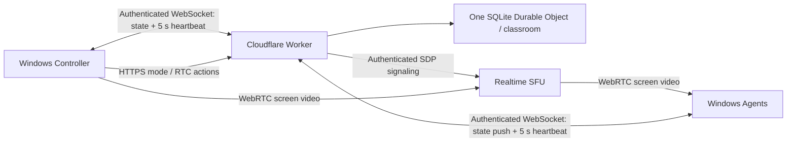

# ClassRelay

**English** | [한국어](README.ko.md)

Screen broadcasting and classroom input control for company-owned Windows training laptops, powered by Cloudflare.

ClassRelay is a proof of concept for one instructor and approximately 30 student devices, including devices on different Wi-Fi networks. The instructor selects a screen to broadcast, presents it fullscreen on student laptops, and optionally suppresses input during instruction. Practice mode releases the student desktops.

> **Status: PoC.** Live Cloudflare media delivery, actual Windows input suppression, login startup, and a 30-device, five-hour session still need validation on training hardware. The desktop interface currently uses Korean; repository documentation is available in English and Korean.

## Features

- Windows **Controller** and **Agent** applications built with Electron.
- Cloudflare Realtime SFU video delivery, with optional TURN support.
- Authenticated classroom state and signaling through Workers and a Durable Object.
- Fullscreen broadcast, optional native keyboard/mouse suppression, and practice mode.
- Automatic reconnection and configurable startup after Windows sign-in.
- A 15-second control lease, independent native watchdog, and `Ctrl+Shift+F12` emergency release.
- Per-device credentials; permanent SFU/TURN secrets stay on the backend.

ClassRelay does not collect student screens, files, or keystrokes, and does not provide remote mouse or keyboard control. Input suppression supports classroom focus; it does not block Windows security screens or `Ctrl+Alt+Delete`.

## Architecture



Control state uses an authenticated WebSocket at `GET /api/connect`. The Worker sends the current state immediately after connection and pushes every command change; each client sends a `heartbeat` message every five seconds. The Controller sends mode and RTC actions through authenticated HTTPS endpoints. REST state and heartbeat routes remain only for compatibility and diagnostics; the applications do not poll them. The Controller has a 15-second server lease, while every Agent independently releases its overlay and input guard when its local lease expires. Durable Object WebSocket hibernation preserves authenticated connection attachments; it does not reset a valid Controller lease. A new Controller connection safely releases an active command before it begins a new session. An expired or emergency-released revision cannot re-lock through reconnection.

See [architecture and security boundaries](docs/architecture.md) and the [API protocol](docs/protocol.md).

## Repository layout

```text
apps/                 Windows Controller / Agent and safety tests
backend/              Worker, Durable Object, SFU/TURN proxy
native-input/         Optional Windows input guard and watchdog
scripts/provision.mjs Per-device credential and configuration generator
docs/                 Architecture, protocol, validation, and field checks
docs/assets/          Repository banner
```

## Requirements

- Windows 10/11 and Node.js 24 LTS with npm.
- A Cloudflare account and Realtime SFU App ID/token.
- Optional TURN Key ID/API token for restricted networks.
- A subdomain of an existing domain managed in Cloudflare DNS.
- The .NET Framework 4.x C# compiler for the native helper.

## Local development

Run these commands in PowerShell:

```powershell
git clone https://github.com/kindsusu/classrelay.git
Set-Location classrelay
npm.cmd ci --prefix backend
npm.cmd ci --prefix apps
Copy-Item -LiteralPath backend/.dev.vars.example -Destination backend/.dev.vars
node scripts/provision.mjs http://127.0.0.1:8787 30
```

The generator creates one Controller configuration, 30 individual Agent configurations, and `backend-secrets.local.json` under `provisioned/`. It does not print credentials and refuses to overwrite existing files. This directory is ignored by Git. Restrict access with Windows file permissions and distribute only the configuration belonging to each device.

Set `CONTROLLER_TOKEN` and `AGENT_TOKENS_JSON` in `backend/.dev.vars` to the generated backend values, then fill in the SFU credentials. The token map must be a JSON object mapping device IDs to tokens. The local Worker does not emulate the SFU; live screen streaming requires real Cloudflare credentials.

Start the backend:

```powershell
npm.cmd run dev --prefix backend
```

In another terminal, start the Controller:

```powershell
$env:CLASSROOM_CONFIG = (Resolve-Path -LiteralPath provisioned/controller.local.json).Path
npm.cmd start --prefix apps
```

Start an Agent with its own configuration:

```powershell
$env:CLASSROOM_CONFIG = (Resolve-Path -LiteralPath provisioned/student-01.local.json).Path
npm.cmd start --prefix apps
```

`127.0.0.1` works only on the same development computer. Devices on other networks must use the deployed HTTPS backend origin. If testing both roles on one PC, the Agent's fullscreen window may cover the Controller; know the `Ctrl+Shift+F12` emergency shortcut first.

## Deploy to Cloudflare

1. Create a Realtime SFU app and obtain its ID/token. Create TURN credentials if needed.
2. Review `backend/wrangler.jsonc`. Use separate deployments and credentials for separate classrooms.
3. Upload generated classroom credentials and enter SFU/TURN secrets through the CLI prompts:

```powershell
Set-Location backend
npx.cmd wrangler login
npx.cmd wrangler secret bulk ../provisioned/backend-secrets.local.json
npx.cmd wrangler secret put SFU_APP_ID
npx.cmd wrangler secret put SFU_APP_TOKEN
# Optional TURN configuration
npx.cmd wrangler secret put TURN_KEY_ID
npx.cmd wrangler secret put TURN_API_TOKEN
npm.cmd run deploy
```

4. Add a custom domain such as `classroom.example.com` under the Worker's **Settings → Domains & Routes**, using your own domain. Verify DNS and TLS activation.
5. Set every application's `backendUrl` to that HTTPS origin. Check `/health`, then connect one Controller and one Agent before increasing the device count.
6. After training, disable Agent startup and revoke unused credentials. Remove unused Worker, SFU, and TURN resources.

Do not put secrets into command arguments, source files, or logs. Cloudflare deployment has not been performed as part of this PoC.

## Build the Windows application

From the repository root:

```powershell
powershell.exe -NoProfile -File native-input/build.ps1
npm.cmd run dist --prefix apps
# Optional installer build
npm.cmd run dist:installer --prefix apps
```

Build output goes to `apps/dist/`. Configuration files are not embedded in the application. Binaries and dependencies are excluded from this Git repository. Builds are unsigned unless you supply your own signing configuration.

Set `nativeInputLock` to `true` in an Agent configuration to enable the native keyboard/mouse guard. The default is `false`, which uses only the fullscreen kiosk and application input shield. The helper has an independent 15-second watchdog and emergency release.

Startup means **after Windows sign-in**, not a service running before sign-in. See the [desktop application guide](apps/README.md) and [native helper guide](native-input/README.md) for configuration, startup behavior, and limitations.

## Validation

```powershell
npm.cmd test --prefix backend
npm.cmd run typecheck --prefix backend
npm.cmd test --prefix apps
npm.cmd run check --prefix apps
node scripts/ws-smoke.mjs
```

The [verification record](docs/verification.md) distinguishes completed local checks from untested live behavior. Follow the [field acceptance checklist](docs/acceptance.md), progressing through 1, 3, 10, and 30 devices. Verify network loss, instructor shutdown, Agent failure, and emergency release before the full training session.

## Scope and limitations

- One instructor and one classroom per deployment; no multi-instructor coordination or account-management UI.
- Screen video only; no remote control, student screen collection, or file transfer.
- State delivery depends on the active WebSocket and network conditions; test immediate broadcast, lock, and practice transitions on real devices.
- The initial target is 30 students for one five-hour session on Cloudflare's free plan. Estimated video payload is 67.5 GB at 1 Mbps, 135 GB at 2 Mbps, or 270 GB at 4 Mbps. These figures exclude overhead, retransmission, TURN, and other account usage. Realtime's monthly 1,000 GB combined SFU/TURN allowance and free-plan behavior can change; monitor usage and do not treat this as a hard spend cap or a zero-cost guarantee.
- After an instructor restart, select the screen and start broadcasting again. Old locks are not restored.
