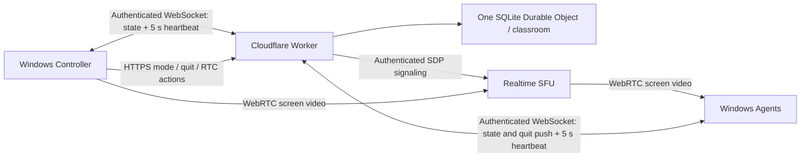

# ClassRelay

**English** | [한국어](README.ko.md)

Screen broadcasting and classroom input control for company-owned Windows training laptops, powered by Cloudflare.

ClassRelay is a proof of concept for one instructor and approximately 30 student devices, including devices on different Wi-Fi networks. The instructor selects a screen, presents it fullscreen on student laptops, and can suppress student input while teaching. Practice mode releases the student desktops.

> **Status: PoC.** The backend has been measured against a live deployment and a one-instructor/one-student screen broadcast has run on real hardware. The Windows input lock, the student-app shutdown, live screen switching, real throughput, 30 devices, the five-hour soak, and login auto-start are **not** verified. See [Status](#status). The desktop interface is Korean; repository documentation is English with a matching Korean version.

## Features

- Windows **Controller** and **Agent** applications built with Electron.
- Four class modes, from free practice to a full input lock.
- Cloudflare Realtime SFU video delivery, with optional TURN for restricted networks.
- Authenticated classroom state and signaling through a Worker and a Durable Object.
- Per-device send-quality caps so a long class stays inside the bandwidth budget.
- Automatic reconnection and configurable startup after Windows sign-in.
- A 15-second control lease, an independent native watchdog, frozen-video detection, and a `Ctrl+Shift+F12` emergency release.
- Per-device credentials; permanent SFU/TURN secrets stay on the backend.

ClassRelay does not collect student screens, files, or keystrokes, and does not provide remote mouse or keyboard control. Input suppression supports classroom focus; it does not block Windows security screens or `Ctrl+Alt+Delete`.

## Class modes

The instructor picks one of four modes. The wire value is what the backend stores; the Korean label is what both apps show.

| Wire | Korean label | Student screen | Student input |
|---|---|---|---|
| `practice` | 실습 | Agent window hidden | Free |
| `broadcast` | 화면 보여주기 | Instructor screen, fullscreen | Free |
| `lecture` | 이론 모드 | Instructor screen, fullscreen and unobscured | Locked |
| `lock` | 강사 주목 | Deliberately obscured | Locked |

Every non-practice mode puts the Agent window into kiosk fullscreen, so the Windows taskbar and all window chrome are covered. **Kiosk is not an input lock.** It hides chrome; it does not stop keystrokes. In `broadcast` the student's input is deliberately left free.

Exactly two modes suppress input, and one predicate decides it: `locksInput(mode)`, true for `lecture` and `lock` and nothing else. It exists on both sides of the wire — `backend/src/index.ts` and `apps/src/safety.cjs` — and every locking decision routes through it, so `lecture` inherits every release path `lock` has.

`broadcast`, `lecture`, and `lock` each require a published instructor track and hold the Controller lease. `practice` is the only mode with a null stream, and it is the fail-safe default every release falls back to.

Actual keyboard and mouse suppression additionally requires `nativeInputLock: true` in that device's configuration. The default is `false`, and with it off both locking modes show their overlay but suppress nothing.

## Fail-safe guarantees

- **The lease is 15 seconds.** Any non-practice mode is released to `practice` on lease expiry, a Controller disconnect, or a new Controller connection. The release increments the revision and clears the stream.
- **A released revision stays released.** Reconnection, a stale state frame, or a late server response cannot re-lock it. Only a new instructor command with a newer revision may lock again.
- **The Agent releases on its own.** A local watchdog drops the classroom view and the input guard when no fresh valid state arrives inside its local lease, when the renderer stops responding, or when the process exits.
- **A frozen picture counts as a failure.** Decoded-frame freshness drives the student's media-ready signal; a sustained stall clears it, which stops the native lock from being renewed, and latches the release for that revision.
- **`Ctrl+Shift+F12` releases immediately** and latches that revision unlocked. It works in every mode.
- **No student screen ever prints the shortcut.** It is not shown on any device, in any mode. Briefing the on-site staff on it is therefore a hard precondition before `nativeInputLock` is enabled anywhere.
- **The native helper has its own watchdog.** `InputGuard.exe` releases on its own lease expiry, on EOF, and on the emergency shortcut, independently of the Electron app.

## What the student screen shows

A healthy non-practice mode shows the instructor's video and nothing else — no status bar, no statistics, no mode caption. The overlay speaks only in four fault conditions: the control connection is lost or reconnecting, a subscription is retrying, a subscription gave up, or the lock was released by the frozen-video fail-safe, the emergency shortcut, a native-guard failure, or a quit request.

Measured send and receive statistics appear on the **instructor's** screen only.

## Shutting down the student apps

`POST /api/agents/quit` is Controller-only and asks every currently connected Agent to quit. The command is transient: it is stored nowhere, so a device that connects afterwards never receives it and never quits. It never touches mode, revision, lease, or stream.

**There is no opposite command.** The instructor cannot restart a student app remotely. Someone at that device has to start it again, or it starts on the next Windows sign-in where automatic launch is configured.

## Architecture



Control state uses an authenticated WebSocket at `GET /api/connect`. The Worker sends the current state immediately after connection and pushes every command change; each client sends a `heartbeat` message every five seconds. The Controller sends mode, quit, and RTC actions through authenticated HTTPS endpoints. REST state and heartbeat routes remain only for compatibility and diagnostics; the applications do not poll them. Durable Object WebSocket hibernation preserves authenticated connection attachments; it does not reset a valid Controller lease.

Switching the shared screen mid-class swaps the outgoing track in place with `RTCRtpSender.replaceTrack()`. There is no renegotiation, no new SFU session, and no mode command, so the class revision does not change — switching screens can neither arm nor release a lock.

See [architecture and security boundaries](docs/architecture.md) and the [API protocol](docs/protocol.md).

## Repository layout

```text
apps/                 Windows Controller / Agent and safety tests
backend/              Worker, Durable Object, SFU/TURN proxy
native-input/         Optional Windows input guard and watchdog
scripts/provision.mjs Per-device credential and configuration generator
scripts/ws-smoke.mjs  Local 30-connection WebSocket fail-safe smoke test
docs/                 Architecture, protocol, verification, and field checks
docs/assets/          Repository banner
```

## Requirements

- Windows 10/11 and Node.js 24 LTS with npm.
- A Cloudflare account and a Realtime SFU App ID/token.
- Optional TURN Key ID/API token for restricted networks.
- A subdomain of an existing domain managed in Cloudflare DNS.
- The .NET Framework 4.x C# compiler for the native helper.

## Local development

Run these commands in PowerShell:

```powershell
git clone https://github.com/kindsusu/classrelay.git
Set-Location classrelay
npm.cmd ci --prefix backend
npm.cmd ci --prefix apps
Copy-Item -LiteralPath backend/.dev.vars.example -Destination backend/.dev.vars
node scripts/provision.mjs http://127.0.0.1:8787 30
```

Set `CONTROLLER_TOKEN` and `AGENT_TOKENS_JSON` in `backend/.dev.vars` to the generated backend values, then fill in the SFU credentials. The token map must be a JSON object mapping device IDs to tokens. The local Worker does not emulate the SFU; live screen streaming requires real Cloudflare credentials.

Start the backend:

```powershell
npm.cmd run dev --prefix backend
```

In another terminal, start the Controller:

```powershell
$env:CLASSROOM_CONFIG = (Resolve-Path -LiteralPath provisioned/controller.local.json).Path
npm.cmd start --prefix apps
```

Start an Agent with its own configuration:

```powershell
$env:CLASSROOM_CONFIG = (Resolve-Path -LiteralPath provisioned/student-01.local.json).Path
npm.cmd start --prefix apps
```

`127.0.0.1` works only on the same development computer. Devices on other networks must use the deployed HTTPS backend origin. If testing both roles on one PC, the Agent's fullscreen window may cover the Controller; know the `Ctrl+Shift+F12` emergency shortcut first.

## Device provisioning

`node scripts/provision.mjs <backend-origin> <device-count>` creates one Controller configuration, one configuration per student device, and `backend-secrets.local.json` under `provisioned/`. It does not print credentials and refuses to overwrite existing files. The directory is ignored by Git. Restrict access with Windows file permissions and distribute only the configuration belonging to each device.

Every student device gets its own random token bound to its own `deviceId`. Do not copy one token to 30 machines: the backend rejects a token presented with another device's ID.

Generated Agent configurations set `nativeInputLock: false`. Turn it on per device, deliberately, and only after the on-site staff for that room know the emergency shortcut.

The optional `video` block bounds what the Controller publishes. Defaults are 720p, 15 fps, and 2,000 kbit/s; each key is validated at startup and an out-of-range or unknown key aborts startup rather than broadcasting uncapped. See the [desktop application guide](apps/README.md) for the accepted ranges.

## Deploy to Cloudflare

1. Create a Realtime SFU app and obtain its ID/token. Create TURN credentials if needed.
2. Review `backend/wrangler.jsonc`. Use separate deployments and credentials for separate classrooms.
3. Upload generated classroom credentials and enter SFU/TURN secrets through the CLI prompts:

```powershell
Set-Location backend
npx.cmd wrangler login
npx.cmd wrangler secret bulk ../provisioned/backend-secrets.local.json
npx.cmd wrangler secret put SFU_APP_ID
npx.cmd wrangler secret put SFU_APP_TOKEN
# Optional TURN configuration
npx.cmd wrangler secret put TURN_KEY_ID
npx.cmd wrangler secret put TURN_API_TOKEN
npm.cmd run deploy
```

4. Add a custom domain such as `classroom.example.com` under the Worker's **Settings → Domains & Routes**, using your own domain. Verify DNS and TLS activation. Serve the Worker from that dedicated subdomain rather than its default workers subdomain.
5. Set every application's `backendUrl` to that HTTPS origin. Check `/health`, then connect one Controller and one Agent before increasing the device count.
6. After training, disable Agent startup and revoke unused credentials. Remove unused Worker, SFU, and TURN resources.

Do not put secrets into command arguments, source files, or logs.

## Build the Windows application

From the repository root:

```powershell
powershell.exe -NoProfile -File native-input/build.ps1
npm.cmd run dist --prefix apps
# Optional installer build
npm.cmd run dist:installer --prefix apps
```

Build output goes to `apps/dist/`. Configuration files are not embedded in the application. Binaries and dependencies are excluded from this Git repository. Builds are unsigned unless you supply your own signing configuration.

Startup means **after Windows sign-in**, not a service running before sign-in. See the [desktop application guide](apps/README.md) and [native helper guide](native-input/README.md) for configuration, startup behavior, and limitations.

## Validation

```powershell
npm.cmd test --prefix backend
npm.cmd run typecheck --prefix backend
npm.cmd test --prefix apps
npm.cmd run check --prefix apps
node scripts/ws-smoke.mjs
```

Backend tests: 61. Desktop tests: 128. CI on the default branch runs all of the above plus the native helper build, its self-test, and a Worker deployment dry-run, and is green.

The [verification record](docs/verification.md) separates what was measured against the live deployment, what ran on real hardware, and what remains untested. Follow the [field acceptance checklist](docs/acceptance.md), progressing through 1, 3, 10, and 30 devices.

## Status

**Measured against the live deployment.** Twenty-one HTTP and WebSocket checks: nine on authentication, roles, roster privacy, and the control socket; twelve on ICE/TURN, covering STUN plus TURN over UDP, TCP, and TLS, credentials differing between consecutive requests, and the permanent key never appearing in a response. TLS validates on the dedicated subdomain.

**Seen on real hardware.** Screen broadcast from one instructor machine to one student machine works.

**Not verified.** Stated plainly, because none of this has been exercised:

- **The Windows input lock has never engaged.** `nativeInputLock` is `false` on every device configuration, so no lock has ever actually run.
- The student-app shutdown has never run on a real device.
- Switching the shared screen has not been tried on real hardware.
- Real throughput. The only figure observed so far — roughly 15 kbps at 1 fps — was a static slide and cannot be used for capacity planning.
- 30 devices, and the five-hour soak.
- Login auto-start.
- Whether the recent fix removed the reported student-screen flicker.

## Scope and limitations

- One instructor and one classroom per deployment; no multi-instructor coordination or account-management UI.
- Screen video only; no remote control, student screen collection, or file transfer.
- State delivery depends on the active WebSocket and network conditions; test immediate broadcast, lecture, lock, and practice transitions on real devices.
- The initial target is 30 students for one five-hour session on Cloudflare's free plan. The video payload works out to 67.5 GB at 1 Mbps per student, 135 GB at 2 Mbps, or 270 GB at 4 Mbps. **These are arithmetic, not measurements**, and they exclude overhead, retransmission, TURN, and other account usage. Realtime's monthly 1,000 GB combined SFU/TURN allowance and free-plan behavior can change; monitor usage and do not treat this as a hard spend cap or a zero-cost guarantee.
- After an instructor restart, select the screen and start broadcasting again. Old locks are not restored.
