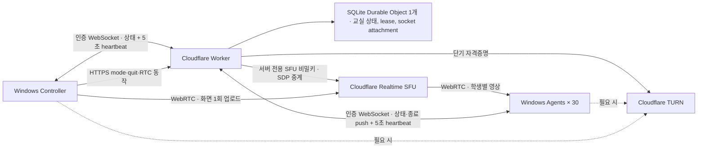

# ClassRelay 아키텍처와 보안 경계

[English](architecture.md)

## 목표와 완료 기준

회사 소유 Windows 노트북 30대에서 서로 다른 Wi-Fi를 통해 강사 화면을 수신한다. 초기 운영 목표는 Cloudflare 무료 플랜에서 5시간 교육 1회다. 강사는 4가지 수업 모드 중 하나를 고른다. 학생 화면·파일·키 입력을 수집하거나 학생 PC를 원격 조작하지 않는다.

최소 완료 기준은 앱 실행, 인증된 WebSocket 상태 전달, SFU 화면 송수신 코드, 재연결, 시간 제한 잠금, 로컬 테스트, 배포 가능한 Worker 구성이다. 실제 Windows 입력 억제와 30대 5시간 soak은 실제 장비로 별도로 수행한다. 무엇이 수행되었고 무엇이 아직인지는 [검증 기록](verification.ko.md)을 본다.

## 수업 모드와 잠금 판정 함수

`mode`는 4개의 wire 이름 중 하나이며, `backend/src/index.ts`의 `MODES`에서 한 번만 열거해 다른 곳에서 목록을 다시 쓰지 않는다. 모드를 구분하는 속성은 둘뿐이다. 학생 장비에 강사 화면이 보이는지, 그리고 학생 입력이 차단되는지다.

| `mode` | 한국어 라벨 | 강사 화면 표시 | 학생 입력 차단 | `stream` |
|---|---|---|---|---|
| `practice` | 실습 | 없음 — Agent 창 숨김 | 아니오 | null |
| `broadcast` | 화면 보여주기 | 있음 | 아니오 | 필수 |
| `lecture` | 이론 모드 | 있음, 가림 없음 | 예 | 필수 |
| `lock` | 강사 주목 | 없음 — 의도적으로 가림 | 예 | 필수 |

입력을 차단하는 모드가 둘이므로 판정은 한 함수가 한다. `locksInput(mode)`는 `lecture`와 `lock`에서만 참이다. 이 함수는 wire 양쪽에 있다. 서버 판정은 `backend/src/index.ts`, Agent 판정은 `apps/src/safety.cjs`이며 어떤 호출처도 mode 문자열을 직접 비교하지 않는다. 네이티브 guard 사용 불가 검사, 렌더러 생존 검사, 250ms 잠금 갱신이 모두 이 함수를 거치므로 `lecture`는 `lock`이 가진 모든 해제 경로를 물려받는다. revision별 비상 해제 latch, 15초 lease, `render-process-gone`, 렌더러 pulse gate, 프리즈 영상 감지가 전부 해당된다. 잠금 모드를 추가해도 `mode === "lock"` 비교가 어딘가에 남는 일이 생기지 않는다.

실습이 아닌 모든 모드는 Agent 창을 kiosk 전체화면으로 만들어 Windows 작업 표시줄과 창 크롬을 덮는다. **kiosk는 창 크롬을 가릴 뿐 입력 잠금이 아니다.** `broadcast`에서는 학생이 Alt+Tab으로 빠져나갈 수 있고, 이는 의도된 것이다. 실제 키보드·마우스 억제는 해당 장비의 `nativeInputLock`이 `true`여야 하며 기본값은 꺼짐이다.

## 설계 결정

- 제어 상태는 인증된 WebSocket `GET /api/connect`으로 한다. Durable Object는 연결 직후와 상태 변경마다 `{ "type": "state", "state": snapshot }`을 보낸다. Controller와 Agent는 5초마다 `{ "type": "heartbeat" }`을 보내며, Agent는 그 프레임에 `mediaReady`를 실을 수 있다. 앱의 지속적인 상태 폴링 없이도 상태 전달과 명시적 생존 확인을 유지한다.
- `GET /api/state`, `POST /api/heartbeat`는 기존 REST 호환성과 진단용으로 남긴다. 정상 제어 전달에는 앱이 WebSocket을 사용한다.
- Controller는 mode·quit·RTC 동작을 인증된 HTTPS endpoint로 보내고 Worker는 결과 상태를 WebSocket으로 전송한다. SQLite 기반 Durable Object 하나가 교실 하나의 명령 상태, 강사 lease, 장비 presence, WebSocket 연결을 관리한다. WebSocket hibernation과 인증된 role·해당 시 device ID·connection ID·last-seen timestamp·media-ready 플래그를 담은 직렬화 attachment를 사용한다. hibernation은 연결 식별을 보존할 뿐 유효한 강사 lease를 초기화하지 않는다. `mediaReady`가 생기기 전에 직렬화된 attachment는 거부하지 않고 `false`로 읽으므로 배포가 살아 있는 학생 연결을 끊지 않는다.
- 강사 lease는 15초다. 강사의 heartbeat가 이를 갱신한다. 만료가 관찰되면 Durable Object는 실습 상태로 바꾸고 stream을 지우며 revision을 올린 뒤 상태를 전송한다. `expireLease()`는 `broadcast`·`lecture`·`lock`을 가리지 않고 명령된 모든 모드를 해제한다. Agent의 독립적인 로컬 watchdog은 유효한 제어 상태를 local lease 안에 받지 못하면 화면 표시와 입력 guard를 해제한다.
- 실습 전환, lease 만료, 비상 해제는 해당 revision에서 해제 상태로 남아야 한다. 재연결, 오래된 상태, 서버 응답으로 다시 잠기면 안 된다. 더 높은 revision의 새 강사 명령만 다시 잠글 수 있다.
- 멈춘 화면은 정상 잠금이 아니라 장애로 취급한다. 디코딩된 프레임의 최신성이 학생의 media-ready 신호를 결정한다. 일정 시간 이상 정체되면 신호가 꺼지고, 그러면 main 프로세스가 네이티브 잠금을 갱신하지 않으며 해당 revision에 해제가 latch된다.
- 수업 중 공유 화면 교체는 `RTCRtpSender.replaceTrack()`으로 송출 트랙을 제자리에서 바꾼다. 재협상도, 새 SFU 세션도, mode 명령도 없으므로 revision이 바뀔 수 없다. 즉 화면 교체로는 잠금을 걸 수도, 이미 해제된 revision을 되살릴 수도 없으며 학생은 같은 구독을 계속 본다.
- 긴 화면 공유는 WebRTC 연결로 유지한다. 연결 장애 시 앱이 재협상하거나 새 세션을 만들며 영구 SFU 키는 학생·강사 앱에 주지 않는다.
- OS 로그인 후 앱 자동 시작을 사용한다. 사용자 로그인 전 서비스 세션은 화면 표시 대상이 아니다. 부팅 직후 교육 화면이 필요하면 조직이 별도로 Windows 교육 계정 로그인 정책을 구성한다.

## 학생 앱 종료

`POST /api/agents/quit`는 강사 전용이며 빈 JSON body를 받고, Durable Object가 연결된 모든 **Agent** 소켓에 `{ "type": "quit" }`을 보낸다. Controller 소켓에는 보내지 않는다. 응답은 몇 개 소켓에 전달했는지를 알려 준다.

이 명령은 의도적으로 **어디에도 저장하지 않는다.** snapshot에도, Durable Object 저장소에도, socket attachment에도 없다. 그 순간 연결된 소켓에 대한 일회성 fanout이므로 이후에 접속한 Agent는 명령을 알지 못하고 종료되지도 않는다. `mode`·`revision`·`leaseMs`·`stream`·강사 lease 어느 것도 건드리지 않는다. 앱을 끄는 일은 fail-safe 상태 기계와 직교하며, `/api/mode`에 `{"mode": "quit"}`을 보내면 잘못된 mode로 거절된다.

**반대 명령은 없다.** ClassRelay의 어떤 부분도 학생 앱을 실행·재시작·기동하지 않고, 학생 PC의 어떤 것도 시작 명령을 기다리지 않는다. 복구는 로컬에서 한다. 그 장비 앞의 사람이 앱을 실행하거나, 자동 시작이 설정된 곳에서는 다음 Windows 로그인 때 실행된다. 이는 의도된 설계다. 원격 시작 기능이야말로 이 PoC가 두지 않기로 한 원격 조작 표면이다.

## 미디어 경로·ICE·협상 순서

**ICE.** `GET /api/ice`는 항상 `{ iceServers: [...] }` 배열을 반환한다. Cloudflare TURN API는 `{ urls, username, credential }` 객체 하나로 응답하는데 Worker가 이를 그대로 넘기지 않고 배열로 감싸므로, 클라이언트는 결과를 `RTCPeerConnection`에 바로 넘길 수 있다. 자격증명은 단기이며 영구 TURN 키는 Worker 밖으로 나가지 않는다.

Worker가 가진 TURN 자격증명이 거절되거나 잘못 설정되면 **502**, 즉 구별되는 서버 오류를 반환한다. 이를 401로 중계해서는 안 된다. `/api/ice`의 401은 언제나 호출자 자신의 bearer 토큰이 거절되었다는 뜻이며, 둘을 뭉개면 실제 원인이 배포 측 TURN 비밀인데도 운영자가 장비 토큰을 뒤지게 된다.

**협상 순서.** offer는 세션 생성과 함께 올라가고 answer는 같은 응답으로 돌아온다. 두 역할 모두 세션 생성 시점에 offer를 낸다. Controller는 캡처한 화면을 위해 `sendonly` video 트랜시버를, Agent는 offer를 만들 대상이 필요하므로 `recvonly` 트랜시버를 추가한다. 따라서 `POST /api/rtc/sessions`는 `{sessionDescription: {type: "offer", sdp}}`를 싣고 `{sessionId, sessionDescription: {type: "answer", sdp}}`를 받으며, `POST /api/rtc/sessions/:id/tracks`는 `{tracks: [...]}`만 싣는다.

**공개된 Cloudflare 스펙은 반대로 기술하고 있으며 낡았다.** 스펙은 body 없는 `/sessions/new`와 이후 `/tracks/new`로 보내는 offer를 설명한다. 이 PoC도 처음에는 그렇게 구현했고, 화면 송출이 매번 첫 호출에서 실패했다. 위 순서는 라이브 API 실측으로 확정했고, 실측한 형태는 백엔드 테스트 fixture에 encode되어 있다. 바꾸기 전에 다시 측정한다.

**`/tracks/new` 쪽은 아직 실제 peer로 검증하지 않았다.** 여기서도 `sessionDescription`이 필요하거나 반환되는지는 알 수 없으므로, 클라이언트는 최소 요청을 보내고 응답에 그것이 있든 없든 처리한다. 실장비 2대 송출 시험이 이를 확정할 것이다. 실측 요청·응답 표는 [통신 규격](protocol.ko.md)을 본다.

## 신뢰 경계

1. **관리자 배포 경계**: 관리자가 학생별 서로 다른 임의 토큰을 배포한다. 공유 학생 토큰 하나를 30대에 복제하지 않는다. 토큰 파일은 해당 Windows 계정과 관리자만 읽도록 관리한다. 로컬 관리자를 적대자로 가정한 DRM·보안 제품은 아니다.
2. **클라이언트/Worker 경계**: WebSocket handshake는 Durable Object가 연결을 받기 전에 인증한다. mode 변경, 학생 앱 종료 요청, 화면 publish는 강사만 할 수 있다. 학생은 자기 세션을 만들고 현재 강사의 영상만 subscribe한다. SFU URL이나 임의 세션을 자유롭게 프록시하지 않는다.
3. **Worker/Cloudflare 경계**: SFU·TURN 비밀은 Wrangler secrets로만 배포한다. 브라우저 스크립트, Git, socket attachment, 로그에 노출하지 않는다. SDP·토큰 본문을 기록하지 않는다. upstream 장애는 Worker 자신의 서버 오류로 보고하며, 원인을 잘못 돌리게 만드는 upstream 상태 코드를 그대로 중계하지 않는다.
4. **Electron 경계**: 로컬 UI, context isolation, 제한된 IPC를 사용한다. 임의 웹페이지에 Node 권한을 주지 않는다. 외부 페이지 탐색을 막고 백엔드 주소를 고정 구성한다.
5. **입력 잠금 경계**: 수업 집중을 위한 사용자 세션 제어다. Windows 보안 화면, 관리자 도구, Ctrl+Alt+Delete를 차단하는 보안 경계로 간주하지 않는다. 비상 해제와 시간 제한을 우선한다. 어떤 학생 화면도 비상 단축키를 표시하지 않으므로, 어느 장비에서든 `nativeInputLock`을 켜기 전에 현장 담당자에게 단축키를 안내해야 한다.

## 복구·운영·용량

실습 전환은 화면 송출 자원을 정리하고 학생의 전체화면·입력 억제를 해제한다. 새 강사 연결은 새 세션을 시작하기 전에 활성 명령을 안전하게 해제한다. 강사 앱을 재시작하면 화면 선택 및 송출을 다시 시작한다. 비상 해제는 해당 revision에서 유지되고 다음 새 명령에서만 재개한다.

송출 품질은 선택 항목인 `video` 블록이 장비별로 제한한다. 기본값은 720p·15fps·2,000kbit/s이며 시작 시 검증하므로, 장시간 수업이 대역폭 예산 안에 머물고 수업 중 화면 교체도 이를 우회하지 못한다. `getStats()` 실측값은 강사 화면에만 표시한다. Agent도 수신 영상을 계속 표본화하지만 그 목적은 표시가 아니라 프리즈 감지다.

학생 30대에 5시간 보내는 영상 payload만 계산하면 학생당 평균 1Mbps에서 약 67.5GB, 2Mbps에서 135GB, 4Mbps에서 270GB다. **이 값은 계산이지 실측이 아니다.** 프로토콜 오버헤드·재전송·TURN relay 트래픽·계정의 다른 사용량이 들어가지 않으며, 이를 대체할 실제 대역폭 실측은 아직 없다. 실제 수업 규모를 잡을 때는 Controller의 실측 표시를 쓴다. 작성 시점의 Cloudflare Realtime SFU·TURN 월 합산 무료량은 1,000GB이지만 요금과 플랜 동작은 바뀔 수 있다. Realtime·Workers·Durable Objects 사용량을 확인하며, 이 추정치를 지출 상한이나 비용 0원 보장으로 해석하지 않는다.

## 참고 자료

- [Cloudflare SFU Connection API](https://developers.cloudflare.com/realtime/sfu/https-api/)
- [Cloudflare TURN 자격증명 발급](https://developers.cloudflare.com/realtime/turn/generate-credentials/)
- [Durable Objects WebSockets](https://developers.cloudflare.com/durable-objects/best-practices/websockets/)
