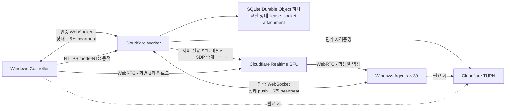

# ClassRelay 아키텍처와 보안 경계

[English](architecture.md)

## 목표와 완료 기준

회사 소유 Windows 노트북 30대에서 서로 다른 Wi-Fi를 통해 강사 화면을 수신한다. 초기 운영 목표는 Cloudflare 무료 플랜에서 5시간 교육 1회다. 강사는 실습 / 전체화면 송출 / 입력 잠금을 선택한다. 학생 화면·파일·키 입력을 수집하거나 학생 PC를 원격 조작하지 않는다.

최소 완료 기준은 앱 실행, 인증된 WebSocket 상태 전달, SFU 화면 송수신 코드, 재연결, 시간 제한 잠금, 로컬 테스트, 배포 가능한 Worker 구성이다. 실제 Cloudflare 송수신과 30대 5시간 soak 검증은 계정 설정 및 실제 장비로 별도로 수행한다.

## 설계 결정

- 제어 상태는 인증된 WebSocket `GET /api/connect`으로 한다. Durable Object는 연결 직후와 상태 변경마다 `{ "type": "state", "state": snapshot }`을 보낸다. Controller와 Agent는 5초마다 `{ "type": "heartbeat" }`을 보낸다. 앱의 지속적인 상태 폴링 없이도 상태 전달과 명시적 생존 확인을 유지한다.
- `GET /api/state`, `POST /api/heartbeat`는 기존 REST 호환성과 진단용으로 남긴다. 정상 제어 전달에는 앱이 WebSocket을 사용한다.
- Controller는 mode·RTC 동작을 인증된 HTTPS endpoint로 보내고 Worker는 결과 상태를 WebSocket으로 전송한다. SQLite 기반 Durable Object 하나가 교실 하나의 명령 상태, 강사 lease, 장비 presence, WebSocket 연결을 관리한다. WebSocket hibernation과 인증된 role·해당 시 device ID·connection ID·last-seen timestamp를 담은 직렬화 attachment를 사용한다. hibernation은 연결 식별을 보존할 뿐, 유효한 강사 lease를 초기화하지 않는다.
- 강사 lease는 15초다. 강사의 heartbeat가 이를 갱신한다. 만료가 관찰되면 Durable Object는 실습 상태로 바꾸고 stream을 지우며 revision을 올린 뒤 상태를 전송한다. Agent의 독립적인 로컬 watchdog은 유효한 제어 상태를 local lease 안에 받지 못하면 화면 표시와 입력 guard를 해제한다.
- 실습 전환, lease 만료, 비상 해제는 해당 revision에서 해제 상태로 남아야 한다. 재연결, 오래된 상태, 서버 응답으로 다시 잠기면 안 된다. 더 높은 revision의 새 강사 명령만 다시 잠글 수 있다.
- 긴 화면 공유는 WebRTC 연결로 유지한다. 연결 장애 시 앱이 재협상하거나 새 세션을 만들며 영구 SFU 키는 학생·강사 앱에 주지 않는다.
- OS 로그인 후 앱 자동 시작을 사용한다. 사용자 로그인 전 서비스 세션은 화면 표시 대상이 아니다. 부팅 직후 교육 화면이 필요하면 조직이 별도로 Windows 교육 계정 로그인 정책을 구성한다.

## 신뢰 경계

1. **관리자 배포 경계**: 관리자가 학생별 서로 다른 임의 토큰을 배포한다. 공유 학생 토큰 하나를 30대에 복제하지 않는다. 토큰 파일은 해당 Windows 계정과 관리자만 읽도록 관리한다. 로컬 관리자를 적대자로 가정한 DRM·보안 제품은 아니다.
2. **클라이언트/Worker 경계**: WebSocket handshake는 Durable Object가 연결을 받기 전에 인증한다. 강사만 mode를 변경하고 화면을 publish한다. 학생은 자기 세션을 만들고 현재 강사의 영상만 subscribe한다. SFU URL이나 임의 세션을 자유롭게 프록시하지 않는다.
3. **Worker/Cloudflare 경계**: SFU·TURN 비밀은 Wrangler secrets로만 배포한다. 브라우저 스크립트, Git, socket attachment, 로그에 노출하지 않는다. SDP·토큰 본문을 기록하지 않는다.
4. **Electron 경계**: 로컬 UI, context isolation, 제한된 IPC를 사용한다. 임의 웹페이지에 Node 권한을 주지 않는다. 외부 페이지 탐색을 막고 백엔드 주소를 고정 구성한다.
5. **입력 잠금 경계**: 수업 집중을 위한 사용자 세션 제어다. Windows 보안 화면, 관리자 도구, Ctrl+Alt+Delete를 차단하는 보안 경계로 간주하지 않는다. 비상 해제와 시간 제한을 우선한다.

## 복구·운영·용량

실습 전환은 화면 송출 자원을 정리하고 학생의 전체화면·입력 억제를 해제한다. 새 강사 연결은 새 세션을 시작하기 전에 활성 명령을 안전하게 해제한다. 강사 앱을 재시작하면 화면 선택 및 송출을 다시 시작한다. 비상 해제는 해당 명령에서 다시 잠기지 않게 유지하고 다음 새 명령에서만 재개한다.

학생 30대에 5시간 보내는 영상 payload만 계산하면 학생당 평균 1Mbps에서 약 67.5GB, 2Mbps에서 135GB, 4Mbps에서 270GB다. 이 추정에는 프로토콜 오버헤드·재전송·TURN relay 트래픽·계정의 다른 사용량이 들어가지 않는다. 작성 시점의 Cloudflare Realtime SFU·TURN 월 합산 무료량은 1,000GB이지만 요금과 플랜 동작은 바뀔 수 있다. Realtime·Workers·Durable Objects 사용량을 확인하며, 이 추정치를 지출 상한이나 비용 0원 보장으로 해석하지 않는다.

## 참고 자료

- [Cloudflare SFU Connection API](https://developers.cloudflare.com/realtime/sfu/https-api/)
- [Cloudflare TURN 자격증명 발급](https://developers.cloudflare.com/realtime/turn/generate-credentials/)
- [Durable Objects WebSockets](https://developers.cloudflare.com/durable-objects/best-practices/websockets/)
