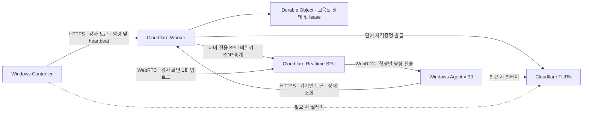

# ClassRelay 아키텍처와 보안 경계

[English](architecture.md)

## 목표와 완료 기준

회사 소유 Windows 노트북 30대에서 서로 다른 Wi-Fi를 통해 강사 화면을 수신한다. 단일 강사·단일 교육실·8시간 교육을 위한 PoC다. 강사는 실습 / 전체화면 송출 / 입력 잠금을 선택한다. 학생 화면·파일·키 입력을 수집하거나 학생 PC를 원격 조작하지 않는다.

최소 완료 기준은 앱 실행, 인증된 상태 변경, SFU 화면 송수신 코드, 재연결, 시간 제한 잠금, 로컬 테스트, 배포 가능한 Worker 구성이다. 실제 Cloudflare 송수신과 30대 장시간 검증은 계정 설정 및 실제 장비로 별도로 수행한다.

## 설계 결정

- 제어는 3초 주기 HTTPS 폴링으로 시작한다. 30대 PoC에서 단순하게 복구할 수 있으며 영상 트래픽은 Worker를 통과하지 않는다. 실습 해제는 정상 네트워크에서 다음 조회 주기에 반영되므로 통상 3초 이내를 목표로 한다. 무지연 보장은 아니다.
- Durable Object 하나가 단일 교실 상태와 인증된 SFU 세션 소유권을 관리한다. 서버 재시작 때 잠금을 복원하지 않는다.
- 강사 heartbeat가 15초 동안 없으면 서버가 실습으로 전환한다. 학생 앱도 서버 상태를 새로 받지 못하면 자체 watchdog으로 표시·잠금을 해제한다. 서버의 응답 성공만으로 만료된 강사 명령을 연장하지 않는다.
- 긴 화면 공유는 WebRTC 연결로 유지한다. 연결 장애 시 재협상 또는 세션을 다시 만들며 영구 SFU 키는 학생·강사 앱에 주지 않는다.
- OS 로그인 후 앱 자동 시작을 사용한다. 사용자 로그인 전 서비스 세션은 화면 표시 대상이 아니다. 부팅 직후 교육 화면이 필요하면 조직이 별도로 Windows 교육 계정 로그인 정책을 구성한다.

## 신뢰 경계

1. **관리자 배포 경계**: 관리자가 학생별 서로 다른 임의 토큰을 배포한다. 공유 학생 토큰 하나를 30대에 복제하지 않는다. 토큰 파일은 해당 Windows 계정과 관리자만 읽도록 관리한다. 로컬 관리자를 적대자로 가정한 DRM·보안 제품은 아니다.
2. **클라이언트/Worker 경계**: 강사만 mode를 변경하고 화면을 publish한다. 학생은 자기 세션을 만들고 현재 강사의 영상만 subscribe한다. SFU URL이나 임의 세션을 자유롭게 프록시하지 않는다.
3. **Worker/Cloudflare 경계**: SFU·TURN 비밀은 Wrangler secrets로만 배포한다. 브라우저 스크립트, Git, 로그에 노출하지 않는다. SDP·토큰 본문을 기록하지 않는다.
4. **Electron 경계**: 로컬 UI, context isolation, 제한된 IPC를 사용한다. 임의 웹페이지에 Node 권한을 주지 않는다. 외부 페이지 탐색을 막고 백엔드 주소를 고정 구성한다.
5. **입력 잠금 경계**: 수업 집중을 위한 사용자 세션 제어다. Windows 보안 화면, 관리자 도구, Ctrl+Alt+Delete를 차단하는 보안 경계로 간주하지 않는다. 비상 해제와 시간 제한을 우선한다.

## 복구 및 운영

실습 전환은 화면 송출 자원을 정리하고 학생의 전체화면·입력 억제를 해제한다. 재접속으로 과거 잠금을 재사용하지 않는다. 강사 앱을 재시작하면 화면 선택 및 송출을 다시 시작한다. 비상 해제는 해당 명령에서 다시 잠기지 않게 유지하고 다음 새 명령에서만 재개한다.

계정의 SFU·TURN·Workers·Durable Objects 사용량을 함께 확인한다. 30대에 평균 1Mbps를 8시간 보내면 영상 payload만 약 108GB이며, 실제량은 재전송·오버헤드·화질에 따라 증가한다. 특정 무료 한도나 비용 0원을 보장하지 않는다.

## 참고 자료

- [Cloudflare SFU Connection API](https://developers.cloudflare.com/realtime/sfu/https-api/)
- [Cloudflare TURN 자격증명 발급](https://developers.cloudflare.com/realtime/turn/generate-credentials/)
- [Durable Objects](https://developers.cloudflare.com/durable-objects/)
