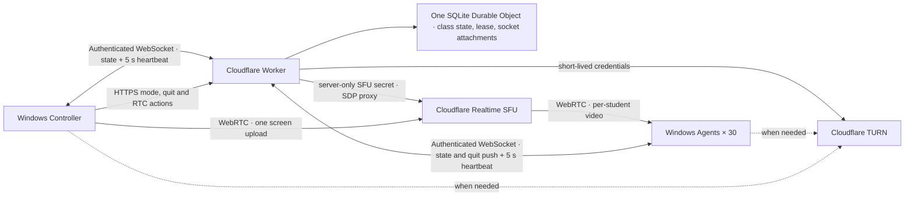

# ClassRelay Architecture and Security Boundaries

[한국어](architecture.ko.md)

## Goal and Completion Criteria

ClassRelay is a proof of concept that delivers one instructor's screen to 30 company-owned Windows laptops across different Wi-Fi networks. The initial operating target is one five-hour session on Cloudflare's free plan. The instructor chooses one of four class modes. It does not collect student screens, files, or keystrokes, and it does not remotely control student PCs.

The minimum completion criteria are runnable applications, authenticated WebSocket state delivery, SFU screen publishing and receiving code, reconnection, time-bounded locking, local tests, and a deployable Worker configuration. Actual Windows input suppression and a five-hour 30-device soak must be performed separately with physical equipment; see the [verification record](verification.md) for what has and has not been exercised.

## Class Modes and the Locking Predicate

`mode` is one of four wire names, enumerated once in `MODES` in `backend/src/index.ts` so no other site lists them. Only two properties distinguish them: whether the instructor's screen is visible on the student device, and whether student input is locked.

| `mode` | Korean label | Instructor screen visible | Student input locked | `stream` |
|---|---|---|---|---|
| `practice` | 실습 | No — the Agent window is hidden | No | null |
| `broadcast` | 화면 보여주기 | Yes | No | required |
| `lecture` | 이론 모드 | Yes, unobscured | Yes | required |
| `lock` | 강사 주목 | No — deliberately obscured | Yes | required |

Two modes lock input, so a single predicate decides it: `locksInput(mode)`, true for `lecture` and `lock` and nothing else. It exists on both sides of the wire — `backend/src/index.ts` for the server's decisions, `apps/src/safety.cjs` for the Agent's — and no call site compares a mode string directly. The native-guard-unavailable check, the renderer-liveness check, and the 250 ms lock renewal all route through it, so `lecture` inherits every release path `lock` has: the per-revision emergency-release latch, the 15-second lease, `render-process-gone`, the renderer pulse gate, and frozen-video detection. Adding a locking mode can never leave a stray `mode === "lock"` behind.

Every non-`practice` mode puts the Agent window into kiosk fullscreen, covering the Windows taskbar and all window chrome. **Kiosk hides chrome; it is not an input lock.** In `broadcast` a student can still Alt+Tab away, deliberately. Actual keyboard and mouse suppression additionally requires `nativeInputLock: true` on that device, which is off by default.

## Design Decisions

- Control uses an authenticated WebSocket at `GET /api/connect`. The Durable Object sends `{ "type": "state", "state": snapshot }` on connection and after every state change. The Controller and Agents send `{ "type": "heartbeat" }` every five seconds; an Agent may carry `mediaReady` on that frame. This avoids continuous application state polling while retaining an explicit liveness signal.
- `GET /api/state` and `POST /api/heartbeat` remain as legacy REST compatibility and diagnostic routes. The applications use the WebSocket connection for normal control delivery.
- The Controller sends mode, quit, and RTC actions through authenticated HTTPS endpoints; the Worker broadcasts the resulting state through WebSocket. One SQLite-backed Durable Object manages one classroom's command state, Controller lease, device presence, and WebSocket connections. It uses WebSocket hibernation with serialized attachments containing the authenticated role, device ID when applicable, connection ID, last-seen timestamp, and media-ready flag. Hibernation preserves connection identity; it does not reset a valid Controller lease. An attachment serialized before `mediaReady` existed is read as `false` rather than rejected, so a deploy does not drop live student connections. The attachment is not rewritten on every heartbeat: `mediaReady` is persisted the instant it changes, `lastSeen` on every second heartbeat, which keeps the persisted value inside the instructor's roster cutoff while halving the Durable Object writes. The five-second heartbeat cadence and the Controller lease renewal are unchanged.
- The Controller lease is 15 seconds. A Controller heartbeat renews it. On an observed expiry, the Durable Object changes the class to practice mode, clears the stream, increments the revision, and broadcasts that state. `expireLease()` releases any commanded mode — `broadcast`, `lecture`, and `lock` alike. The Agent's independent local watchdog releases the display and input guard when it cannot receive a fresh valid control state within its local lease.
- A practice transition, lease expiry, or emergency release must remain released for that revision. Reconnection, stale state, or a server response cannot re-lock it. Only a new Controller command with a newer revision may lock again.
- A frozen picture is treated as a failure, not as a working lock. Decoded-frame freshness drives the student's media-ready signal; a sustained stall clears it, which stops the main process from renewing the native lock, and latches the release for that revision.
- Switching the shared screen mid-class swaps the outgoing track in place with `RTCRtpSender.replaceTrack()`. There is no renegotiation, no new SFU session, and no mode command, so the class revision cannot change — a screen change can neither arm a lock nor resurrect a released revision, and students keep the same subscription throughout.
- Long screen sharing is maintained over WebRTC. On a connection failure, the applications renegotiate or create a new session; permanent SFU keys are never provided to the Student Agent or Controller.
- Applications start automatically after OS sign-in. A service session before a user logs in is not a display target. If an instructional display is required immediately after boot, the organization must separately configure its Windows training-account sign-in policy.

## Agent Shutdown

`POST /api/agents/quit` is Controller-only, takes an empty JSON body, and makes the Durable Object send `{ "type": "quit" }` to every connected **Agent** socket and to no Controller socket. The response reports how many sockets were messaged.

The command is deliberately **stored nowhere** — not in the snapshot, not in Durable Object storage, not in a socket attachment. It is a fire-and-forget fanout over the sockets connected at that instant, so an Agent that connects afterwards never learns of it and never quits. It never touches `mode`, `revision`, `leaseMs`, `stream`, or the Controller lease: shutting an app down is orthogonal to the fail-safe state machine, and `{"mode": "quit"}` on `/api/mode` is rejected as an invalid mode.

**There is no opposite command.** Nothing in ClassRelay launches, restarts, or wakes a student application, and nothing on the student machine waits for a start order. Recovery is local: someone starts the app at that device, or it starts on the next Windows sign-in where automatic launch is configured. This is deliberate — a remote start capability is exactly the remote-control surface this PoC refuses to have.

## Media Path, ICE, and Negotiation Order

**ICE.** `GET /api/ice` always returns `{ iceServers: [...] }` as an array. Cloudflare's TURN API answers with a single `{ urls, username, credential }` object, which the Worker wraps rather than passing through, so a client can hand the result straight to `RTCPeerConnection`. Credentials are short-lived and the permanent TURN key never leaves the Worker.

A rejected or misconfigured Worker-held TURN credential returns **502**, a distinct server error. It must never be proxied as a 401: a 401 from `/api/ice` always means the caller's own bearer token was rejected, and blurring the two sends an operator hunting for a bad device token when the real fault is the deployment's own TURN secret.

**Negotiation order.** The offer goes up with session creation and the answer comes back in that same response. Both roles offer at session creation: the Controller adds a `sendonly` video transceiver for the captured display, the Agent a `recvonly` one so it has something to offer. `POST /api/rtc/sessions` therefore carries `{sessionDescription: {type: "offer", sdp}}` and returns `{sessionId, sessionDescription: {type: "answer", sdp}}`; `POST /api/rtc/sessions/:id/tracks` then carries only `{tracks: [...]}`.

**The published Cloudflare specification says the opposite and is stale.** It describes a body-less `/sessions/new` with the offer sent later to `/tracks/new`. That is what this PoC originally implemented, and screen broadcast failed at the first call every time. The order above was established by measuring the live API, and the measured shape is encoded in the backend test fixtures. Re-measure before changing it.

**The `/tracks/new` half is still unverified against a real peer.** Whether it also requires or returns a `sessionDescription` is unknown, so the client sends the minimal request and tolerates a response with or without one. A real two-machine broadcast run is what will settle it. See [the protocol document](protocol.md) for the measured request/response table.

## Trust Boundaries

1. **Administrator deployment boundary:** Administrators issue a distinct random token to every student. Do not copy one shared student token to all 30 devices. Token files must be readable only by the relevant Windows account and administrators. This is not a DRM or security product that treats a local administrator as an adversary.
2. **Client/Worker boundary:** The WebSocket handshake authenticates before the Durable Object accepts a connection. Only the instructor can change the mode, ask the student apps to quit, and publish a screen. A student can create its own session and subscribe only to the active instructor video. The client cannot freely proxy an SFU URL or arbitrary session.
3. **Worker/Cloudflare boundary:** Deploy SFU and TURN secrets only as Wrangler secrets. Never expose them in browser scripts, Git, socket attachments, or logs. Do not record SDP or token contents. An upstream failure is reported as the Worker's own server error, never as a verbatim upstream status that would misattribute the fault.
4. **Electron boundary:** Use a local UI, context isolation, and restricted IPC. Do not grant Node permissions to arbitrary web pages. Block external navigation and use a fixed backend address.
5. **Input-lock boundary:** This is user-session control for class focus. It is not a security boundary that blocks the Windows secure desktop, administrator tools, or Ctrl+Alt+Delete. Emergency release and time limits take priority. Because no student screen ever displays the emergency shortcut, the on-site staff must be briefed on it before `nativeInputLock` is enabled on any device.

## Recovery, Operations, and Capacity

Changing to practice mode releases screen-sharing resources and the student's full-screen display and input suppression. A new Controller connection safely releases an active command before it begins a new session. When the Controller app restarts, screen selection and sharing start again. An emergency release remains effective for that revision and resumes only with a new command.

Send quality is bounded per device by the optional `video` block — 720p, 15 fps, and 2,000 kbit/s by default — validated at startup, so a long class stays inside the bandwidth budget and a mid-class screen switch cannot slip past it. Measured statistics from `getStats()` are shown on the instructor's screen only; the Agent still samples inbound video, but solely to feed frozen-video detection.

**Durable Object SQLite row writes are the tightest free-plan resource, and the socket attachment is what fills them.** A heartbeat every five seconds from 31 devices over an eight-hour session is 5,760 heartbeats per device and 178,560 in total; writing the attachment on each one would have exceeded the 100,000/day free-plan write budget on its own. It is therefore written only when it has to be: `mediaReady` the instant it changes, and `lastSeen` on every second heartbeat, which bounds the persisted value's lag at about 10 seconds — a full heartbeat period inside the instructor's 15-second roster cutoff. That is 89,280 attachment writes over the same session, and it is what the heartbeat count would have to be measured against in real billing. The Controller lease deadline is excluded from this and still written on every Controller heartbeat (about 5,760 in a session, one device): a stored deadline that lagged the last heartbeat would expire a live lease early, and the moment a lease expires is not tradeable for write count. **These are projections against published limits, not measurements of billed usage**, and whether an attachment write is even billed as a SQLite row write is not something Cloudflare's documentation states.

For 30 students over five hours, video payload alone works out to approximately 67.5 GB at an average 1 Mbps per student, 135 GB at 2 Mbps, and 270 GB at 4 Mbps. **These figures are arithmetic, not measurements.** They exclude protocol overhead, retransmission, TURN relay traffic, and other usage in the account, and no real throughput measurement exists yet to replace them — use the Controller's measured line when sizing a real class. Cloudflare Realtime SFU and TURN have a combined monthly 1,000 GB free allowance at the time of writing, but pricing and plan behavior may change. Monitor Realtime, Workers, and Durable Objects usage; this estimate is neither a hard spend cap nor a promise of zero cost.

## References

- [Cloudflare SFU Connection API](https://developers.cloudflare.com/realtime/sfu/https-api/)
- [Cloudflare TURN credential generation](https://developers.cloudflare.com/realtime/turn/generate-credentials/)
- [Durable Objects WebSockets](https://developers.cloudflare.com/durable-objects/best-practices/websockets/)
