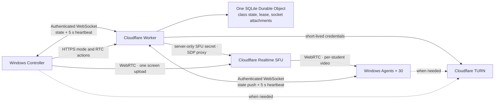

# ClassRelay Architecture and Security Boundaries

[한국어](architecture.ko.md)

## Goal and Completion Criteria

ClassRelay is a proof of concept that delivers one instructor's screen to 30 company-owned Windows laptops across different Wi-Fi networks. The initial operating target is one five-hour session on Cloudflare's free plan. The instructor can choose practice mode, full-screen broadcast, or input lock. It does not collect student screens, files, or keystrokes, and it does not remotely control student PCs.

The minimum completion criteria are runnable applications, authenticated WebSocket state delivery, SFU screen publishing and receiving code, reconnection, time-bounded locking, local tests, and a deployable Worker configuration. Actual Cloudflare streaming and a five-hour 30-device soak must be performed separately with a configured account and physical equipment.

## Design Decisions

- Control uses an authenticated WebSocket at `GET /api/connect`. The Durable Object sends `{ "type": "state", "state": snapshot }` on connection and after every state change. The Controller and Agents send `{ "type": "heartbeat" }` every five seconds. This avoids continuous application state polling while retaining an explicit liveness signal.
- `GET /api/state` and `POST /api/heartbeat` remain as legacy REST compatibility and diagnostic routes. The applications use the WebSocket connection for normal control delivery.
- The Controller sends mode and RTC actions through authenticated HTTPS endpoints; the Worker broadcasts their resulting state through WebSocket. One SQLite-backed Durable Object manages one classroom's command state, Controller lease, device presence, and WebSocket connections. It uses WebSocket hibernation with serialized attachments containing the authenticated role, device ID when applicable, connection ID, and last-seen timestamp. Hibernation preserves connection identity; it does not reset a valid Controller lease.
- The Controller lease is 15 seconds. A Controller heartbeat renews it. On an observed expiry, the Durable Object changes the class to practice mode, clears the stream, increments the revision, and broadcasts that state. The Agent's independent local watchdog releases the display and input guard when it cannot receive a fresh valid control state within its local lease.
- A practice transition, lease expiry, or emergency release must remain released for that revision. Reconnection, stale state, or a server response cannot re-lock it. Only a new Controller command with a newer revision may lock again.
- Long screen sharing is maintained over WebRTC. On a connection failure, the applications renegotiate or create a new session; permanent SFU keys are never provided to the Student Agent or Controller.
- Applications start automatically after OS sign-in. A service session before a user logs in is not a display target. If an instructional display is required immediately after boot, the organization must separately configure its Windows training-account sign-in policy.

## Trust Boundaries

1. **Administrator deployment boundary:** Administrators issue a distinct random token to every student. Do not copy one shared student token to all 30 devices. Token files must be readable only by the relevant Windows account and administrators. This is not a DRM or security product that treats a local administrator as an adversary.
2. **Client/Worker boundary:** The WebSocket handshake authenticates before the Durable Object accepts a connection. Only the instructor can change the mode and publish a screen. A student can create its own session and subscribe only to the active instructor video. The client cannot freely proxy an SFU URL or arbitrary session.
3. **Worker/Cloudflare boundary:** Deploy SFU and TURN secrets only as Wrangler secrets. Never expose them in browser scripts, Git, socket attachments, or logs. Do not record SDP or token contents.
4. **Electron boundary:** Use a local UI, context isolation, and restricted IPC. Do not grant Node permissions to arbitrary web pages. Block external navigation and use a fixed backend address.
5. **Input-lock boundary:** This is user-session control for class focus. It is not a security boundary that blocks the Windows secure desktop, administrator tools, or Ctrl+Alt+Delete. Emergency release and time limits take priority.

## Recovery, Operations, and Capacity

Changing to practice mode releases screen-sharing resources and the student's full-screen display and input suppression. A new Controller connection safely releases an active command before it begins a new session. When the Controller app restarts, screen selection and sharing start again. An emergency release remains effective for that command and resumes only with a new command.

For 30 students over five hours, video payload alone is approximately 67.5 GB at an average 1 Mbps per student, 135 GB at 2 Mbps, and 270 GB at 4 Mbps. These estimates exclude protocol overhead, retransmission, TURN relay traffic, and other usage in the account. Cloudflare Realtime SFU and TURN have a combined monthly 1,000 GB free allowance at the time of writing, but pricing and plan behavior may change. Monitor Realtime, Workers, and Durable Objects usage; this estimate is neither a hard spend cap nor a promise of zero cost.

## References

- [Cloudflare SFU Connection API](https://developers.cloudflare.com/realtime/sfu/https-api/)
- [Cloudflare TURN credential generation](https://developers.cloudflare.com/realtime/turn/generate-credentials/)
- [Durable Objects WebSockets](https://developers.cloudflare.com/durable-objects/best-practices/websockets/)
