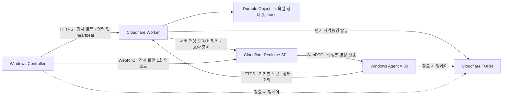

# ClassRelay Architecture and Security Boundaries

[한국어](architecture.ko.md)

## Goal and Completion Criteria

ClassRelay is a proof of concept that delivers one instructor's screen to 30 company-owned Windows laptops across different Wi-Fi networks. It is designed for one instructor, one classroom, and an eight-hour training session. The instructor can choose practice mode, full-screen broadcast, or input lock. It does not collect student screens, files, or keystrokes, and it does not remotely control student PCs.

The minimum completion criteria are runnable applications, authenticated state changes, SFU screen publishing and receiving code, reconnection, time-bounded locking, local tests, and a deployable Worker configuration. Actual Cloudflare streaming and an extended 30-device test must be performed separately with a configured account and physical equipment.

## Design Decisions

- Control starts with HTTPS polling every three seconds. This is simple to recover for a 30-device PoC, and video traffic does not pass through the Worker. Under normal network conditions, a switch to practice mode is reflected by the next poll, typically within three seconds. This is not a zero-latency guarantee.
- One Durable Object manages a single classroom's state and ownership of authenticated SFU sessions. It never restores a lock after a server restart.
- If the instructor heartbeat is absent for 15 seconds, the server changes the classroom to practice mode. If the Student Agent cannot obtain a fresh server state, its own watchdog releases the display and input lock. A successful server response alone does not extend an expired instructor command.
- Long screen sharing is maintained over WebRTC. On a connection failure, the applications renegotiate or create a new session; permanent SFU keys are never provided to the Student Agent or Controller.
- Applications start automatically after OS sign-in. A service session before a user logs in is not a display target. If an instructional display is required immediately after boot, the organization must separately configure its Windows training-account sign-in policy.

## Trust Boundaries

1. **Administrator deployment boundary:** Administrators issue a distinct random token to every student. Do not copy one shared student token to all 30 devices. Token files must be readable only by the relevant Windows account and administrators. This is not a DRM or security product that treats a local administrator as an adversary.
2. **Client/Worker boundary:** Only the instructor can change the mode and publish a screen. A student can create its own session and subscribe only to the active instructor video. The client cannot freely proxy an SFU URL or arbitrary session.
3. **Worker/Cloudflare boundary:** Deploy SFU and TURN secrets only as Wrangler secrets. Never expose them in browser scripts, Git, or logs. Do not record SDP or token contents.
4. **Electron boundary:** Use a local UI, context isolation, and restricted IPC. Do not grant Node permissions to arbitrary web pages. Block external navigation and use a fixed backend address.
5. **Input-lock boundary:** This is user-session control for class focus. It is not a security boundary that blocks the Windows secure desktop, administrator tools, or Ctrl+Alt+Delete. Emergency release and time limits take priority.

## Recovery and Operations

Changing to practice mode releases screen-sharing resources and the student's full-screen display and input suppression. Reconnection never reuses an earlier lock. When the instructor app restarts, screen selection and sharing start again. An emergency release remains effective for that command and resumes only with a new command.

Monitor SFU, TURN, Workers, and Durable Objects usage together. Sending an average 1 Mbps stream to 30 devices for eight hours produces roughly 108 GB of video payload alone; actual usage increases with retransmission, overhead, and quality. No free-tier limit or zero cost is guaranteed.

## References

- [Cloudflare SFU Connection API](https://developers.cloudflare.com/realtime/sfu/https-api/)
- [Cloudflare TURN 자격증명 발급](https://developers.cloudflare.com/realtime/turn/generate-credentials/)
- [Durable Objects](https://developers.cloudflare.com/durable-objects/)
